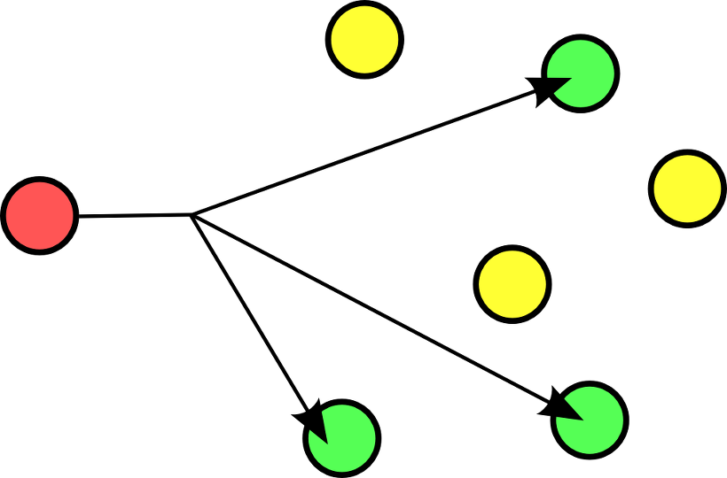
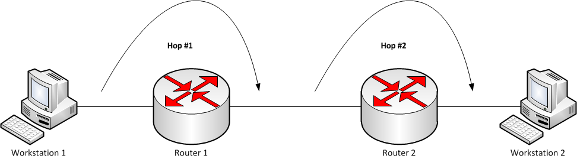

# Chapter14. 멀티캐스트 & 브로드캐스트

멀티캐스트 방식의 데이터 전송은 UDP 를 기반으로 한다. 차이점이 있다면 UDP에서의 데이터 전송은 하나의 목적지를 두고 이뤄지지만
멀티캐스트에서의 데이터 전송은 특정 그룹에 가입되어 있는 다수의 호스트가 된다는 점이다.

## 멀티캐스트의 데이터 전송특성

> 사진 출처: https://limkydev.tistory.com/16

1. 멀티캐스크 서버는 특정 멀티캐스트 그룹을 대상으로 데이터를 딱 한번 전송한다.
2. 딱 한번 전송하더라도 그룹에 속하는 클라이언트는 모두 데이터를 수신한다.
3. 멀티캐스트 그룹의 수는 IP 주소 범위 내에서 얼마든지 추가 가능하다.
4. 특정 멀티캐스트 그룹으로 전송되는 데이터를 수신하려면 해당 그룹에 가입하면 된다.
5. 멀티캐스트는 스위치나 라우터에서 지원을 해주어야만 한다. 아니면 패킷이 버려진다.

> 멀티캐스트 그룹은 클래스 D(224.0.0.0~239.255.255.255)에 속하는 IP 주소이다.

Q. 트래픽 측면에서 부정적으로 볼 수 밖에 없지 않나요?
A. 하나의 영역에 동일한 패킷이 둘 이상 전송되지 않으므로 무히려 좋다.

### TTL

멀티캐스트 패킷의 전송을 위해서는 TTL(Time to live)의 설정과정을 반드시 거쳐야 한다. 이는 **패킷을 얼마나 멀리 전달할 것인가** 를 결정하는 주 요소가 된다.

이 값은 라우터(Hop)를 하나 거칠 때마다 1씩 감소하며 0이 되면 더 이상 전달되지 못하고 소멸한다.

## 브로드캐스트

멀티캐스트는 서로 다른 네트워크상에 존재하는 호스트라 할지라도 그룹에 가입되어 있다면 데이터 수신이 가능하다.

하지만 브로드캐스트는 동일한 네트워크로 연결되어 있는 호스트만 데이터가 전송된다.

브로드캐스트는 CPU 인터럽트를 걸기 때문에(이 패킷이 나에게 필요한 것인지 확인하기 때문) 성능에 좋지 못하다.

일반적으로 MAC 주소를 얻기 위해 사용된다.

## + 유니캐스트

유니캐스트는 1:1 방식으로 현재 네트워크에서 가장 많이 사용되는 통신에 해당한다.(TCP)

정확한 MAC 주소를 기반으로 하기 때문에 CPU 인터럽트를 하지 않는다.

### 루프백 주소(loopback address)

IP 주소 클래스에 해당하는 번호는 127번이 제외되어 있다. 이 번호는 `127.0.0.1` 번으로 사용하는 특별한 주소이기에 어느 클래스에도 속하지 않는다.

이는 자기가 사용하는 랜카드(NIC) 자신을 의미한다. 따라서 `127.0.0.1`, `localhost` 를 호스트로 사용하면 자기 자신에게 통신을 하게 된다.
